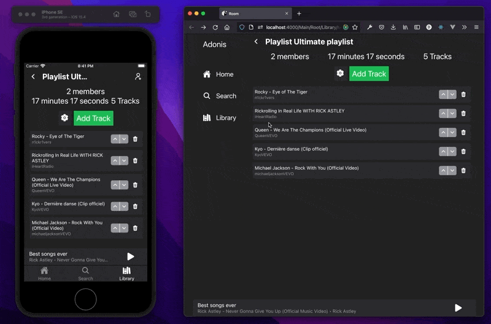

# MusicRoom

## Application definition

Cross-platform iOS, Android and Web application using React Native (Expo) and Adonis and Temporal within one monorepo.

[Open subject of the 42 school project →](docs/en.subject.pdf)

## Music Track vote

A Music Track Vote (MTV) is a collaborative music listening session in which users suggest and vote for tracks to be played.

The creator can define several options during room creation, such as position and time constraints, to only allow users located at a certain place and at certain time to vote.

Creator can choose between two emission modes: _broadcast_ and _direct_. In _broadcast_ mode, all users play the sound. In _direct_ mode, only one user in the room emits sound. This user is defined by the creator or by users with the explicit permission.

Users can play sound on only one of their devices and are free to choose on which one.

It’s also possible to create private MTV rooms that only invited users can join.

When joining a MTV room, depending on their permissions, users should be able to suggest a track, vote for other tracks and control the player (play, pause, play next track).

Users can chat and follow other users in the MTV room.

## Music Playlist Editor

A Music Playlist Editor (MPE) is a real time collaborative playlist.

Users create or join MPE rooms in which they suggest tracks, remove tracks, change tracks order and export the playlist into an MTV.

Users can be members of several MPE rooms at the same time, that are listed on their Library.

When exporting an MPE room into an MTV room, users define the configuration of the MTV room, whose initial tracks are the tracks of the playlist.

## Technical Stack

[See Technical stack →](docs/technical-stack.md)

[See Setup →](docs/setup.md)
