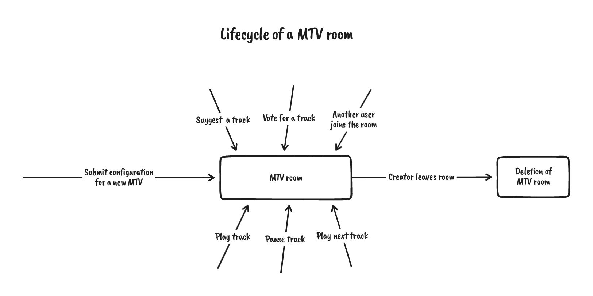

# Technical stack

The project is a monorepo built using yarn workspaces and Lerna.
It includes mainly 3 packages.

### **Client**

-   [React Native](https://reactnative.dev/) ( [Expo](https://docs.expo.dev/) ), to build Android & iOS & Web applications
-   [XState](https://xstate.js.org/docs/), handle logic inside state machines
-   [Dripsy](https://www.dripsy.xyz/), centralize style
-   [socket.io-client](https://github.com/socketio/socket.io-client)
-   [Jest](https://jestjs.io/) + [Testing Library](https://testing-library.com/)

### **Adonis microservice**

1. Adonis server:
    - [Adonis](https://adonisjs.com/), lucid/auth/session
    - [Japa](https://japa.dev/) + [Sinon](https://sinonjs.org/)
    - [socket.io](https://socket.io/fr/docs/v4/server-installation/) & [socket.io-redis-adapter](https://socket.io/docs/v4/redis-adapter/)
    - [googleapis](https://github.com/googleapis/google-api-nodejs-client), Places/YouTube Data
2. [Redis](https://redis.io/) instance
3. [PostgreSQL](https://www.postgresql.org/) database

### **Temporal microservice**

1. [Golang](https://go.dev/) API, our custom API build above temporal:
    - [Brainy](https://github.com/Devessier/brainy) (for creating state machines)
    - `go test` + [testify](https://github.com/stretchr/testify)
    - [Temporal Go SDK](https://docs.temporal.io/docs/go/)
2. [Temporal](https://docs.temporal.io/) Server
    1. PostgreSQL (used internally by Temporal Server)

### E2E tests

We’re also end-to-end testing the application using **[Playwright](https://playwright.dev/)**

## Music Track Vote

### Lifecycle of a MTV room

### Internals of MTV rooms

**Backend**

When a user submits the configuration for a new MTV room, we start a Temporal _workflow_. The workflow waits for _signals_ (play, pause, vote for a track, ...) which mutate its internal state. The workflow of an MTV room is a source of truth that can _really_ be trusted: all signals sent to a workflow are processed sequentially, preventing concurrency issues.

[See Temporal workflow for MTV rooms →](https://github.com/AdonisEnProvence/MusicRoom/blob/9f9ed6b783cc3d2f9e0a8146e6ca9f5aa0a96bdb/packages/temporal/mtv/workflows/mtv.go#L57)

**Frontend**

A XState machine is used client-side to handle MTV rooms, from creation to playing state. The logic code is centralized, and only things defined in the machine can happen, preventing again concurrency issues to happen, like the pause button being shown while the video does not play.

[See machine orchestrating MTV room →](https://github.com/AdonisEnProvence/MusicRoom/blob/9f9ed6b783cc3d2f9e0a8146e6ca9f5aa0a96bdb/packages/client/machines/appMusicPlayerMachine.ts)

## Music Playlist Editor

### Lifecycle of an MPE room

### Internals of MPE rooms

**Backend**

As for MTV rooms, when a user submits the configuration for a new MPE room, we start a Temporal _workflow_ that waits for _signals_ (change track up or down, remove track, add track...). The workflow mutates its own state depending on the operation it receives. Temporal allows to avoid a lot of edge cases: if two users change the order of the same track at the same time, the last operation received fails.

[See Temporal workflow for MPE rooms →](https://github.com/AdonisEnProvence/MusicRoom/blob/9f9ed6b783cc3d2f9e0a8146e6ca9f5aa0a96bdb/packages/temporal/mpe/workflows/mpe.go#L111)

**Frontend**

Client-side, the main difference between MTV rooms and MPE rooms management is that several MPE rooms can live at the same time for a single user. We use a XState machine that orchestrates MPE rooms and that can handle an infinite number of them. When a user joins or creates an MPE room, we _spawn_ a child machine for it. XState promotes decoupling independent logic blocks by making use of the Actor model. Each MPE room is then an actor represented by a state machine communicating with its direct parent.

[See machine orchestrating MPE rooms →](https://github.com/AdonisEnProvence/MusicRoom/blob/9f9ed6b783cc3d2f9e0a8146e6ca9f5aa0a96bdb/packages/client/machines/appMusicPlaylistsMachine.ts)

## Microservices communication

Adonis and Temporal both handle business logic. All microservices communicate with each other when operations on an MTV or an MPE room are performed.

When a user wants to pause an MTV room, the following sequence of actions is executed:

A basic MTV room operation, such as an MTV_PAUSE operation, will go through all the microservices before resulting to pausing the client music player.

In TypeScript microservices, we parse inputs with [Zod](https://github.com/colinhacks/zod), that allows to statically type variables at build time and to validate them at runtime with the same code.
